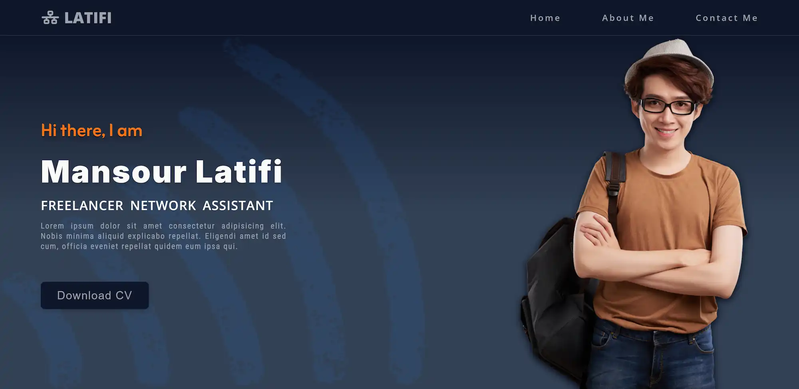
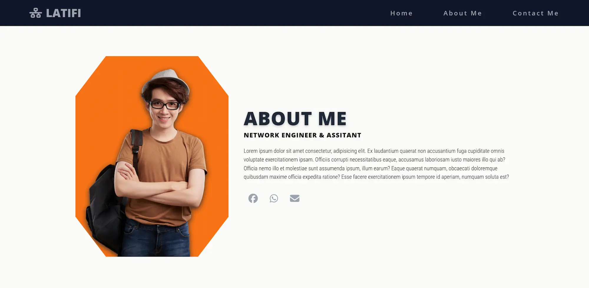
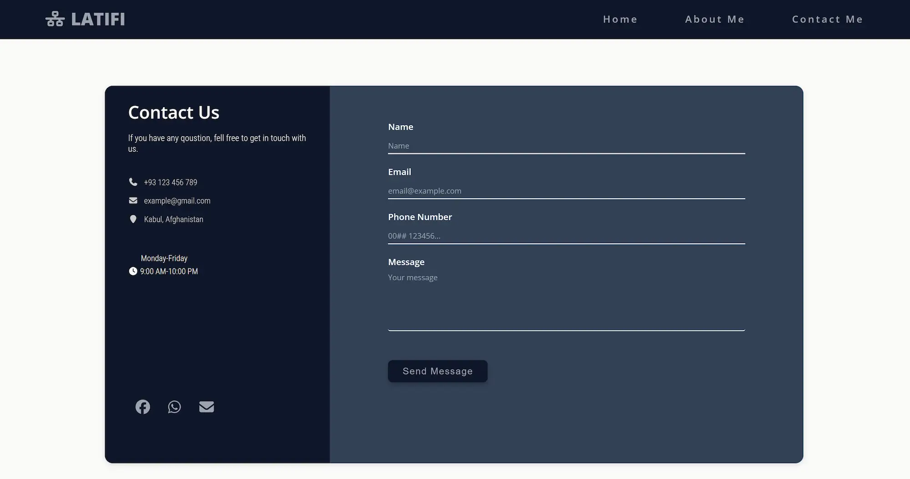

🌟 Personal Portfolio

Welcome to my portfolio application! This is a modern, responsive portfolio built with React and Vite, showcasing my skills, projects, and experience as a web developer.

🚀 Overview

This portfolio serves as a personal showcase of my work — from projects to skills — and is designed to help recruiters and collaborators quickly understand what I build and how I work.

📌 Tech Stack:

React
Vite
JavaScript
CSS / Custom Styling
Responsive design

🧠 Features

✨ Interactive UI
✨ Responsive on all screen sizes
✨ Fast and lightweight (powered by Vite)
✨ Clean code structure and easy to customize

## 🌐 Live Demo

🔗 **Live Preview:** https://Aymaq-code.github.io/portfolio/

## 📸 Preview

